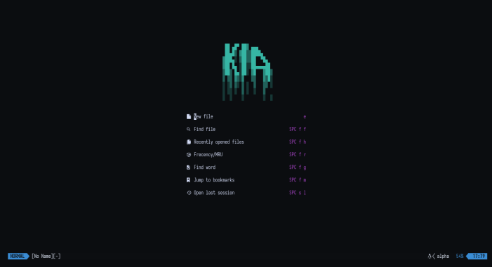
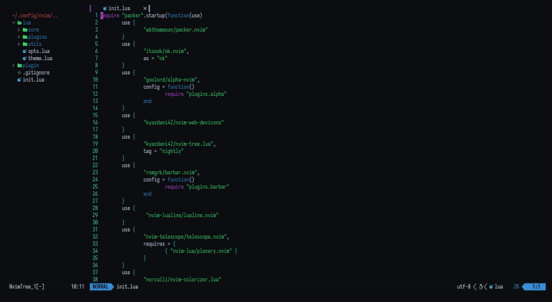
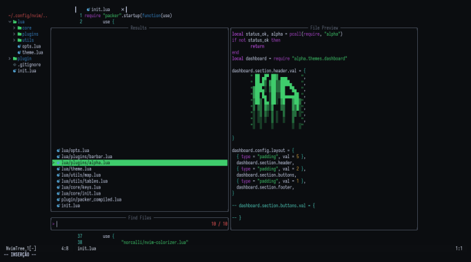

<div align="center">
	<h2>💐 kia!</h2>
	<p><strong>wip</strong> nvim config with ok-theme and more.
</div>

## plugins

- [nvim-tree.nvim](https://github.com/kyazdani42/nvim-tree.lua) as tree
- [ok.nvim](https://github.com/itsook/ok.nvim) as theme
- [alpha-nvim](https://github.com/goolord/alpha-nvim) as start page/dash
- [packer](https://github.com/wbthomason/packer.nvim) as plugin manager
- [barbar](https://github.com/romgrk/barbar.nvim) as buffer line
- [lualine](https://github.com/nvim-lualine/lualine.nvim) as status line
- [nvim-web-devicons](https://github.com/kyazdani42/nvim-web-devicons) as icons
- [colorizer](https://github.com/norcalli/nvim-colorizer.lua) as colors plugin


## gallery






## installation 

clone:

```
git clone https://github.com/justleoo/kia.git $HOME/.config/nvim
```

install:

```
nvim +PackerSync
```

## license 

see [license](https://github.com/justleoo/kia/blob/main/LICENSE)
